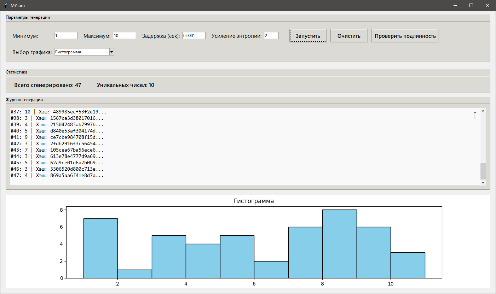

# МУтант — Генератор криптографически стойких случайных чисел

**МУтант** — это графическое приложение на Python, которое генерирует случайные числа с усиленной энтропией, визуализирует их различными способами и позволяет проверять подлинность каждой генерации с помощью цепочки хэшей.

## 🚀 Возможности

- Генерация случайных чисел с криптографическим усилением
- Регулируемые параметры генерации: минимум, максимум, задержка, уровень энтропии
- Множество видов графиков:
  - Гистограмма
  - KDE
  - Ящик с усами
  - Круговая диаграмма
  - Скользящее окно
  - Диаграмма рассеяния и др.
- Проверка подлинности сгенерированных чисел (hash chaining)
- Визуальный журнал генерации


## 📷 Скриншоты




## 🛠️ Установка

Убедитесь, что у вас установлен Python 3.7+

1. Клонируйте репозиторий:

```bash
git clone https://github.com/ManaJ0KE/crypto-random-gui.git
cd crypto-random-gui
```
2. Установите зависимости:

```bash
pip install -r requirements.txt
```
3. Запустите программу:

```bash
python rand.py
```
